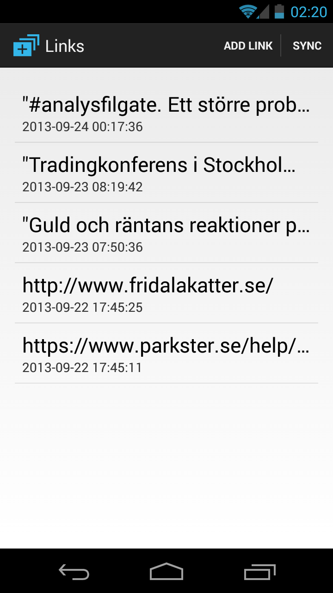

## Goals

1. Learn how to implement an Android app which utilises __GCM__,
to a server-side app.
2. Learn how to make a server-side app with a __REST__ interface and
connections to GCM.

This project is divided into two parts: the Android client and the server app.
My own motivations for this project is to learn how to make a server side
app. I already know how to make Android apps but know very little about
web programming. So this will be outside of my comfort zone. I have used
_REST_ interfaces plenty, but never implemented one before. Likewise,
I am familiar with _GCM_ but have only seen crappy sample implementations
so far.

I stipulate the following requirements for the projects:

__Serverside:__
* Should be written in _Python_
* Have a __REST__ api
* Use __GCM__
* Require login but don't handle passwords

__Androidside:__
* No passwords
* All network stuff should be done in a _SyncAdapter_
* Get push updates through __GCM__
* Full syncs using __REST__

## Can't I read all this somewhere already?
Yes you can! There are a lot of documents, tutorials, sample code
and help you can get online, many times straight from Google themselves!
The problem is that there is __a lot__ of documents, tutorials etc.
And they all __focus on one thing__. Either it's a document about
making a _SyncAdapter_, or it's a tutorial on _GCM_, or a document
about making a _WebApp_.

It's all about __context__. Maybe I haven't looked hard enough, but
to my eyes no one gives you the big picture and the technical details.
Google's own documents on _GCM_ is a prime example: they talk at length
about the structure of the system, and give you plenty of sample code
for the client side, but are incredibly vague on the server bit. They
mention the requirement of an _application server_ but give no help
in creating one.

Again, it's all about __context__. The _GCM_ docs focus on how to implement
the _GCM_ bits, so it's not that weird that it doesn't go into newbie
hints on application servers. But no one else seems to do that either.
Another thing is that there are a ton of documents that are out-dated.

For example, stay away from all server-libraries developed by Google.
The Java versions might be good, but the Python versions __SUCK DONKEY BALLS__.
Python __IS NOT AN EXCUSE TO USE GLOBAL VARIABLES ****ING EVERYWHERE__.

In short, I will attempt to deliver both the
_big picture_ and the _nitty gritty details_ in this project that no one
else seems keen on writing down.

## Target audience
This is not a tutorial for someone looking to write their first Android
app or program. I assume that you have worked with Android before. I also
expect that you are familiar with some concepts, at least in theory, like
_REST APIs_ or _Sqlite_. I do try to explain the idea behind the
implementations but I will not go into detail as to why I had that particular
idea over another.

## Intent
I do not claim that this code is ready for anything other than a base to
build upon for your own projects. It is __NOT PRODUCTION READY__.
People with more expertise than myself can probably improve upon several
aspects, and I welcome any suggestions/merge requests that can improve
the project. As I said, when it comes to server apps, I'm also something
of a newbie.

## Why Python for the server app?
_Python_ is by far my current favorite language. It takes so much less
bloat compared to _Java_ to translate an idea into a working implementation.
Hopefully, I will convince you along the way that _Python_ is awesome.
Even if you are not familiar with _Python_, I bet that it will be possible
for you to understand the program completely anyway. Because it's that
simple.

## Format of the tutorial
The _READMEs_ go through the construction of the apps step by step. They
specify what __SHA1__ corresponds to that state in the tutorial. That
means that you can examine all pieces of the project at that particular
state by doing:

```shell
git checkout <sha1>
```

Just do this to get back to the normal state
```shell
git checkout master
```


What is particularly useful is that you can do direct comparisons
to see all changes between one state and the next by doing:

```shell
git diff <sha1> <sha1>
```

And you can show the differences for a particular
file/folder with:

```shell
git diff <sha1> <sha1> <filename-or-folder>
```

I highly recommend doing it to see exactly what lines of code
were added to implement some feature. Here's an example
that would show what was added to enable authentication
with Google in the server-app:

```shell
git diff 599d6fda70f 94011e7b6d2 server-app/app.py server-app/google_auth.py
```

## Requirements
You should read the [official docs on GCM](http://developer.android.com/google/gcm/gcm.html)

You also need to create a project in the [Google API console](https://code.google.com/apis/console)

For the purpose of this tutorial, the docs are somewhat confusing in regards
to what key you need to generate. You need to generate the following
types of keys:

* Client ID for installed applications ([Guide](https://developers.google.com/+/mobile/android/getting-started))
* Simple API Access ([Guide](http://developer.android.com/google/gcm/gs.html))

The _Simple API key_ will be used by the server to verify the validity of
authentication tokens generated by the client. To generate the token, the
clients need the _Client ID for installed apps_, but you won't need a specific
key in that case since Google will verify the package name of
the application. You will need the project number in the client though, which
you can see in the address bar of your browser:

```
https://code.google.com/apis/console/#project:8646666293:access
```

Where _8646666293_ is your project number.

### Server app
In this folder I construct an app we can deploy on a webserver somewhere.
Go into the _server-app_ folder and see how that's done.

The server is coded in _Python_ because _Java_ is mostly bloat.

### Android app
In this folder I implement an android app. This will be fairly straightforward.
Have a look in _android-client_ for that.

## Result
You can download the finished app and try it out for yourself here:

[apk file](https://github.com/spacecowboy/AndroidGCMTutorial/releases/download/v1.0/AndroidLinksGCM-release.apk)

It connects to a running version of the server-app. And looks like this:


