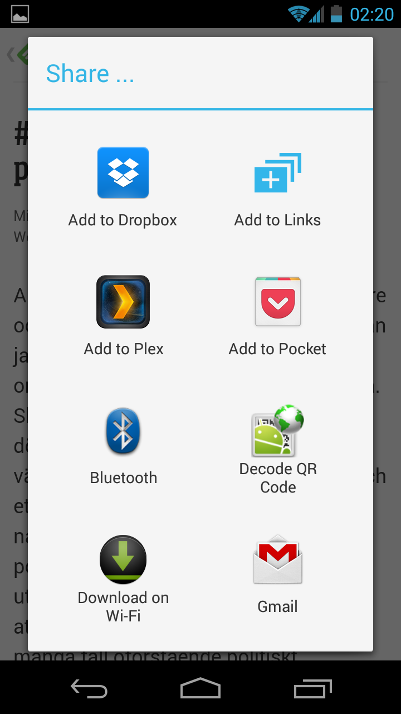
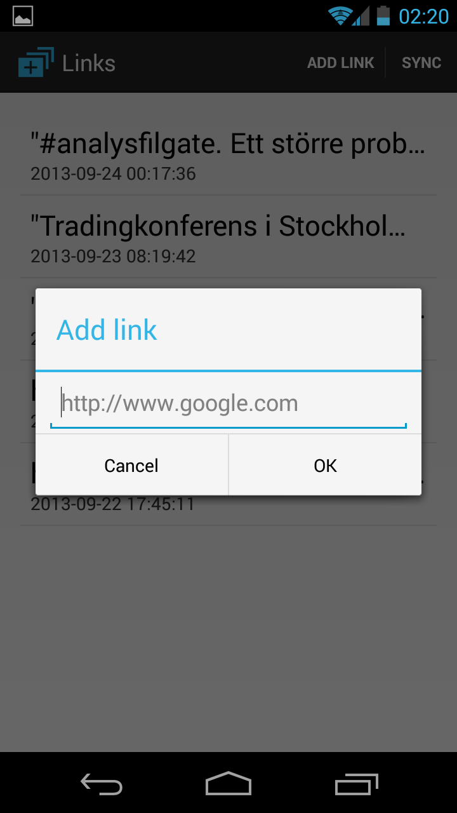

## Basic app
__SHA1__: 8e1146e3f53f8

This is not a tutorial in making apps in general, so the starting point
is a working local-only app. No synchronization or network connectivity
is implemented at all. The app simply stores a list of links in its local
database. A user can share a link from anywhere and select 'Add to Links'
to add links easily and quickly.





## Adding synchronization with a SyncAdapter
__SHA1__: b9f8624fa038f0

Synchronization needs to be done on a background thread. One could use an
AsyncTask, but we are going to go all the way and a SyncAdapter here instead.
Why? A SyncAdapter handles all the syncing for you. There is no need to
request a sync manually, you set a period and you're done. Even better,
a SyncAdapter respects the user's global sync setting. So if the user has
turned off sync, our app will respect that.

Setting up a SyncAdapter is fairly well covered in the docs so I won't go
too far into specifics there. What needs to be clarified are the bits that
make it work with the user's Google account.

### Idea
The general idea is as follows:
1. Get an access token
2. Upload new items and deletions from the client
3. Download new items and deletions from the server (if we have synced before, only fetch items newer than last time)
4. Save the timestamp from this sync for next time

The syncing model is simple because the app doesn't really have the idea
of updates. There is no way to update individual entries, only add new
ones or delete them. Hence we avoid the problem of sync conflicts
entirely. If your use case involves updating things, you'll have to
consider some kind of conflict resolution.

HTTP-requests are handled with an excellent library for _REST_ requests:
[Retrofit](http://square.github.io/retrofit/) by
[Square](http://square.github.io/). All necessary libraries are included
in the _libs_ folder.

### Code
Note below that I specify _"com.google"_ as the account type. This means
that our app will show up in the global sync settings under the Google
account. The authority is the same as specified in the ContentProvider.

__syncadapter.xml:__
```xml
<?xml version="1.0" encoding="utf-8"?>
<!--
  Important to use my own authority
  also specify that we want to use standard google account as the type
  also we want to be able to upload etc...
-->

<sync-adapter xmlns:android="http://schemas.android.com/apk/res/android"
    android:contentAuthority="com.nononsenseapps.linksgcm.database.AUTHORITY"
    android:accountType="com.google"
    android:supportsUploading="true"
    android:userVisible="true"
/>
```

The SyncAdapter itself is very simple, here is the onPerform method
as the rest is just short boilerplate:
```java
	@Override
	public void onPerformSync(Account account, Bundle extras, String authority,
			ContentProviderClient provider, SyncResult syncResult) {
		try {
			// Need to get an access token first
			final String token = SyncHelper.getAuthToken(getContext(),
					account.name);

			if (token == null) {
				Log.e(TAG, "Token was null. Aborting sync");
				// Sync is rescheduled by SyncHelper
				return;
			}

			// Just to make sure. Can happen if sync happens in background first time
			if (null == SyncHelper.getSavedAccountName(getContext())) {
				PreferenceManager.getDefaultSharedPreferences(getContext())
						.edit().putString(SyncHelper.KEY_ACCOUNT, account.name)
						.commit();
			}
			// token should be good. Transmit

			final LinksServer server = SyncHelper.getRESTAdapter();
			DatabaseHandler db = DatabaseHandler.getInstance(getContext());

			// Upload stuff
			for (LinkItem item : db.getAllLinkItems(LinkItem.COL_SYNCED
					+ " IS 0 OR " + LinkItem.COL_DELETED + " IS 1", null, null)) {
				if (item.deleted != 0) {
					// Delete the item
					server.deleteLink(token, item.sha);
					syncResult.stats.numDeletes++;
					db.deleteItem(item);
				}
				else {
					server.addLink(token, item);
					syncResult.stats.numInserts++;
					item.synced = 1;
					db.putItem(item);
				}
			}

			// Download stuff - but only if this is not an upload-only sync
			if (!extras.getBoolean(ContentResolver.SYNC_EXTRAS_UPLOAD, false)) {
				// Check if we synced before
				final String lastSync = PreferenceManager
						.getDefaultSharedPreferences(getContext()).getString(
								KEY_LASTSYNC, null);

				final LinkItems items;
				if (lastSync != null && !lastSync.isEmpty()) {
					items = server.listLinks(token, "true", lastSync);
				}
				else {
					items = server.listLinks(token, "false", null);
				}

				if (items != null && items.links != null) {
					for (LinkItem item : items.links) {
						if (item.deleted == 0) {
							item.synced = 1;
							db.putItem(item);
						}
						else {
							db.deleteItem(item);
						}
					}
				}

				// Save sync timestamp
				PreferenceManager.getDefaultSharedPreferences(getContext())
						.edit().putString(KEY_LASTSYNC, items.latestTimestamp)
						.commit();
			}
		}
		catch (RetrofitError e) {
			Log.d(TAG, "" + e);
			final int status;
			if (e.getResponse() != null) {
				Log.e(TAG, "" + e.getResponse().getStatus() + "; " + e.getResponse().getReason());
				status = e.getResponse().getStatus();
			}
			else {
				status = 999;
			}
			// An HTTP error was encountered.
			switch (status) {
			case 401: // Unauthorized
				syncResult.stats.numAuthExceptions++;
				break;
			case 404: // No such item, should never happen, programming error
			case 415: // Not proper body, programming error
			case 400: // Didn't specify url, programming error
				syncResult.databaseError = true;
				break;
			default: // Default is to consider it a networking problem
				syncResult.stats.numIoExceptions++;
				break;
			}
		}
	}
```

Let's have look at the SyncHelper class next. That's where the
access token is retrieved:

__SyncHelper.java:__
```java
public class SyncHelper {

	public static final String KEY_ACCOUNT = "key_account";
	public static final String SCOPE = "oauth2:https://www.googleapis.com/auth/userinfo.email";
	static final String TAG = "Links";

	public static LinksServer getRESTAdapter() {
		RestAdapter restAdapter = new RestAdapter.Builder().setServer(
				LinksServer.API_URL).build();
		return restAdapter.create(LinksServer.class);
	}

	public static String getSavedAccountName(final Context context) {
		return PreferenceManager.getDefaultSharedPreferences(context)
				.getString(SyncHelper.KEY_ACCOUNT, null);
	}

	public static String getAuthToken(final Context context) {
		final String accountName = getSavedAccountName(context);
		if (accountName == null || accountName.isEmpty()) {
			return null;
		}

		return getAuthToken(context, accountName);
	}

	/**
	 * Only use this in a background thread, i.e. the syncadapter.
	 */
	public static String getAuthToken(final Context context,
			final String accountName) {
		try {
			return GoogleAuthUtil.getTokenWithNotification(context,
					accountName, SCOPE, null, ItemProvider.AUTHORITY, null);
		}
		catch (UserRecoverableNotifiedException userRecoverableException) {
			// Unable to authenticate, but the user can fix this.
			Log.e(TAG,
					"Could not fetch token: "
							+ userRecoverableException.getMessage());
		}
		catch (GoogleAuthException fatalException) {
			Log.e(TAG, "Unrecoverable error " + fatalException.getMessage());
		}
		catch (IOException e) {
			Log.e(TAG, e.getMessage());
		}
		return null;
	}

	public static Account getAccount(final Context context,
			final String accountName) {
		final AccountManager manager = AccountManager.get(context);
		Account[] accounts = manager
				.getAccountsByType(GoogleAuthUtil.GOOGLE_ACCOUNT_TYPE);
		for (Account account : accounts) {
			if (account.name.equals(accountName)) {
				return account;
			}
		}
		return null;
	}

	public static void manualSync(final Context context) {
		final String email = getSavedAccountName(context);

		if (email != null) {
			// Set it syncable
			final Account account = getAccount(context, email);

			if (!ContentResolver.isSyncActive(account, ItemProvider.AUTHORITY)) {
				Bundle options = new Bundle();
				// This will force a sync regardless of what the setting is
				// in accounts manager. Only use it here where the user has
				// manually desired a sync to happen NOW.
				// options.putBoolean(ContentResolver.SYNC_EXTRAS_MANUAL, true);
				ContentResolver.requestSync(account, ItemProvider.AUTHORITY,
						options);
			}
		}
	}
}
```

_accountName_ is the e-mail address of the user. If you're confused,
focus entirely on the _getAuthToken_ method. It returns an access token
if the user has/will authorized the app, and null if the user declined.
This is supposed to be used in the SyncAdapter, and what happens the first
time if unauthorized is that a notification will appear. If clicked,
the user gets a question if he/she wants to authorize the app to
access the profile information. We get authorized to see the user's
email address but little else.

The actual network communication is handled by the excellent
[Retrofit](http://square.github.io/retrofit/) library. This
is all the code necessary to define how to communicate with
the _REST_ server defined in the server:

__LinksServer.java:__
```java
public interface LinksServer {

	public static final String API_URL = "http://links.nononsenseapps.com";

	public static class LinkItems {
		String latestTimestamp;
		List<LinkItem> links;
	}

	public static class Dummy {
		// Methods must have return type
	}

	@GET("/links")
	LinkItems listLinks(@Header("Bearer") String token,
			@Query("showDeleted") String showDeleted,
			@Query("timestampMin") String timestampMin);

	@GET("/links/{sha}")
	LinkItem getLink(@Header("Bearer") String token, @Path("sha") String sha);

	@DELETE("/links/{sha}")
	Dummy deleteLink(@Header("Bearer") String token, @Path("sha") String sha);

	@POST("/links")
	LinkItem addLink(@Header("Bearer") String token, @Body LinkItem item);
}
```

You define an interface, and the library takes care of building an
actual object that talks to the server. Note that because the database
object _LinkItem_ has public fields, we can use it directly in this
interface. This is seriously __ALL__ the code required to talk
with a rest server. Notice also that the definitions match those
in the server.

That was __IT__. There are a few additional convenience classes and such
that I included to make the app more user friendly but this is all
that takes place behind the scenes.

As the user adds new links or removes existing ones, the SyncAdapter
takes care of uploading those events to the server as they happen.
Typically they are scheduled after a short delay (~20 seconds) to
allow several actions to be bunched together.

The download part happens at fixed times though. Either the user hits sync
inside the app, or it's once a day.
Currently, there's just no way for the server to notify a
device that there is new data available on the server.
That's where _GCM_ comes in.


## Adding GCM
__SHA1:__ 94011e7b6d21f

CloudMessaging is the final piece of our networked app. By using _GCM_,
the server can pass a message to Google, and ask it to relay it to the
device(s) at the most oppertune moment. If the device is offline, GCM
queues the message for transmission later when the device comes back.

The way it works is as follows:

1. Device1 uploads a new or deleted link to server as before using the REST API.
2. Server stores the data in the database as before.
3. Server hands the same data to GCM in a request to send to Device2,3,...
4. GCM does its magic and delivers the data to the specified devices.
5. Device2,3... adds or deletes the link from step 1 to their databases

Client side, I have adapted the sample classes by Google for our
purposes. GCM works in two parts: first the app has to register for GCM
and second it will receive Intents through a BroadcastReceiver.

A small tweak has been made to the _REST_ api. It accepts an optional query
parameter called _regid_. By sending the device's own registration id
to the server when links are uploaded, the server can make sure to _avoid_
sending a GCM message to the same device about a link itself uploaded.
If DeviceA uploads Link1, then only devices B and C needs to get a
GCM message about Link1.

### Registering
First step is handled in the SyncAdapter when we are syncing anyway.
A snippet shows the change:

*In __onPerformSync()__*
```java
//...
if (token == null) {
    Log.e(TAG, "Token was null. Aborting sync");
    // Sync is rescheduled by SyncHelper
    return;
}
// token should be good. Transmit

// Register for GCM if we need to
GCMHelper.registerIfNotAlreadyDone(getContext());

final LinksServer server = SyncHelper.getRESTAdapter();
DatabaseHandler db = DatabaseHandler.getInstance(getContext());

// Upload stuff
//...
```

__GCMHelper__ is a class with a couple of convenience methods.
The interesting ones are these:

*Snippet of __GCMHelper.java__*
```java
    /**
     * Handle registrations. If already registered, returns.
     */
    public static void registerIfNotAlreadyDone(final Context context) {
        if (!isPlayServicesAvailable(context)) {
            return;
        }

        final String regid = getRegistrationId(context);
        if (regid.isEmpty()) {
            registerForGCM(context);
        }
    }

    private static void registerForGCM(final Context context) {
        try {
            GoogleCloudMessaging gcm = GoogleCloudMessaging
                    .getInstance(context);

            final String regid = gcm.register(GCMConfig.SENDER_ID);

            if (sendRegistrationIdToBackend(context, regid)) {

                // Persist the regID - no need to register again.
                storeRegistrationId(context, regid);
            }
        }
        catch (IOException ex) {
            // If there is an error, don't just keep trying to register.
            // Require the user to click a button again, or perform
            // exponential back-off.
        }
    }

    private static boolean sendRegistrationIdToBackend(final Context context,
            final String regid) {
        // Need to get an access token first
        final String token = SyncHelper.getAuthToken(context,
                SyncHelper.getSavedAccountName(context));

        if (token == null) {
            return false;
        }

        // token should be good. Transmit
        final LinksServer server = SyncHelper.getRESTAdapter();
        final RegId item = new RegId();
        item.regid = regid;
        server.registerGCM(token, item);

        return true;
    }
```

Notice that we send the registration id to the server using a
new REST-method called "registerGCM". It simply adds the registration
id to a table on the server's database.

### Receiving GCM messages
In step 2, the messages are delivered to our Broadcast manager:

__GCMReceiver.java:__
```java
public class GCMReceiver extends WakefulBroadcastReceiver {
	public GCMReceiver() {
	}

	@Override
	public void onReceive(Context context, Intent intent) {
		// Explicitly specify that GcmIntentService will handle the intent.
        ComponentName comp = new ComponentName(context.getPackageName(),
                GCMIntentService.class.getName());
        // Start the service, keeping the device awake while it is launching.
        startWakefulService(context, (intent.setComponent(comp)));
        setResultCode(Activity.RESULT_OK);
	}
}
```

Which just offloads the work to a service:

__GCMIntentService.java:__
```java
public class GCMIntentService extends IntentService {
	public GCMIntentService() {
		super("GCMIntentService");
	}

	@Override
	protected void onHandleIntent(Intent intent) {
		Bundle extras = intent.getExtras();
		GoogleCloudMessaging gcm = GoogleCloudMessaging.getInstance(this);
		// The getMessageType() intent parameter must be the intent you received
		// in your BroadcastReceiver.
		String messageType = gcm.getMessageType(intent);

		if (!extras.isEmpty()) { // has effect of unparcelling Bundle
			/*
			 * Filter messages based on message type. Since it is likely that
			 * GCM will be extended in the future with new message types, just
			 * ignore any message types you're not interested in, or that you
			 * don't recognize.
			 */

			// If it's a regular GCM message, do some work.
			if (GoogleCloudMessaging.MESSAGE_TYPE_MESSAGE.equals(messageType)) {
				// Write link to database
				final LinkItem link = new LinkItem();
				link.sha = extras.getString("sha");
				link.timestamp = extras.getString("timestamp");
				link.url = extras.getString("url");
				link.synced = 1;
				link.deleted = Integer.parseInt(extras.getString("deleted", "0"));

				if (link.deleted == 0) {
					DatabaseHandler.getInstance(this).putItem(link);
				} else {
					DatabaseHandler.getInstance(this).deleteItem(link);
				}

				Log.i("linksgcm", "Received: " + extras.toString() + ", deleted: " + link.deleted);
			}
			else if (GoogleCloudMessaging.MESSAGE_TYPE_DELETED
					.equals(messageType)) {
				// We reached the limit of 100 queued messages. Request a full
				// sync
				SyncHelper.requestSync(this);
			}
		}
		// Release the wake lock provided by the WakefulBroadcastReceiver.
		GCMReceiver.completeWakefulIntent(intent);
	}
```

And that is all there is to it really. This is all the result
of following the steps on
[http://developer.android.com/google/gcm/client.html](http://developer.android.com/google/gcm/client.html).


## Summary
So what we have now is an app that stores simple pieces of text
in a local database. An incredibly boring app if weren't for the
fact that it keeps that database synchronized across all of your
devices. Structure of the app is as follows:

* Code relevant for the app, like it UI and such are present in
the package _com.nononsenseapps.linksgcm_.
* Data is stored in a database, which is handled by the classes
present in _com.nononsenseapps.linksgcm.database_.
* All code that handles synchronization and uploading is located
in _com.nononsenseapps.linksgcm.sync_.
* Receiving messages from other devices through GCM is handled
in _com.nononsenseapps.linksgcm.gcm_
